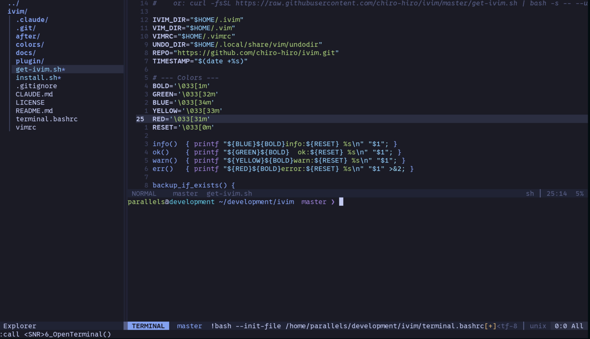

# iVim

A lightweight, standalone Vim configuration built for security engineers and DevOps professionals. Zero plugins, zero dependencies, zero attack surface.

```
      _ __   __ _
     (_)\ \ / /(_)_ __ ___
     | | \ V / | | '_ ` _ \
     | |  \_/  | | | | | | |
     |_|       |_|_| |_| |_|
```

## Why iVim?

When you SSH into a production server, audit a remote system, or work inside a hardened container, you need an editor that **just works** without pulling packages from the internet.

- **No plugins** -- nothing to install, update, or trust
- **No external dependencies** -- pure Vimscript, ships as a directory
- **No network calls** -- safe for air-gapped and restricted environments
- **Graceful degradation** -- works on Vim 8.0+ and falls back cleanly on minimal builds (`vim-tiny`, no clipboard, no mouse)
- **Tokyo Night theme** -- easy on the eyes during long sessions, with full 256-color fallback



## Install

### One-line install (from GitHub)

```bash
curl -fsSL https://raw.githubusercontent.com/chiro-hiro/ivim/master/get-ivim.sh | bash
```

### Uninstall

```bash
curl -fsSL https://raw.githubusercontent.com/chiro-hiro/ivim/master/get-ivim.sh | bash -s -- --uninstall
```

### Local install (from clone)

```bash
git clone https://github.com/chiro-hiro/ivim.git
cd ivim
./install.sh
```

Both methods back up your existing `~/.vim` and `~/.vimrc` with timestamps. Uninstall restores the most recent backup.

## Key Mappings

Leader key is **Space**. iVim only adds new bindings -- no default Vim keys are overridden.

### Files

| Key | Action |
|-----|--------|
| `Space w` | Save |
| `Space q` | Quit (confirm unsaved) |
| `Space x` | Save and quit |
| `Space e` | Toggle file explorer |
| `Space t` | Open terminal |

### Buffers

| Key | Action |
|-----|--------|
| `Space bn` | Next buffer |
| `Space bp` | Previous buffer |
| `Space bd` | Delete buffer |
| `Space bl` | List buffers |

### Splits

| Key | Action |
|-----|--------|
| `Space sv` | Vertical split |
| `Space sh` | Horizontal split |
| `Ctrl h/j/k/l` | Navigate splits |
| `Space =` | Equalize splits |

### Search

| Key | Action |
|-----|--------|
| `Space /` | Clear search highlight |
| `Space sf` | Search in files (vimgrep) |

### Quickfix

| Key | Action |
|-----|--------|
| `Space co` | Open quickfix |
| `Space cc` | Close quickfix |
| `]q` | Next quickfix item |
| `[q` | Previous quickfix item |

### Clipboard

| Key | Action |
|-----|--------|
| `Space y` | Yank to system clipboard |
| `Space p` | Paste from system clipboard |

### Tabs

| Key | Action |
|-----|--------|
| `Space Tn` | New tab |
| `Space Tc` | Close tab |

### Autocomplete (popup menu)

Popup appears automatically in code buffers as you type; these keys take effect only when the popup is visible, otherwise behave normally.

| Key | Action |
|-----|--------|
| `Tab` | Next completion item |
| `Shift-Tab` | Previous completion item |
| `Enter` | Accept selection (no newline inserted) |
| `Esc` | Cancel popup and exit insert mode |

### Other

| Key | Action |
|-----|--------|
| `Space a` | Select all |

## Features

### Tokyo Night Colorscheme

Full implementation of the Tokyo Night "night" palette with both true color (`termguicolors`) and 256-color terminal support. Every highlight group defines dual `gui`/`cterm` values.

### Custom Statusline

- Mode indicator with per-mode colors (Normal/Insert/Visual/Replace/Command)
- Git branch display (cached, no shell calls during render)
- File path, modified/readonly flags, filetype, encoding, position
- Active/inactive window differentiation
- Clean tabline with filename only

### File Explorer

- Tree view sidebar with smooth box-drawing characters
- Files always open in the editor pane (never in terminal or explorer)
- Toggle with `Space e`

### Integrated Terminal

- Opens below at ~1/3 height
- Tokyo Night bash prompt with `user@host`, directory, and git branch
- Auto-closes on quit -- no "job still running" errors

### Autocomplete

IDE-style auto-completion with zero plugins. Typing 2+ identifier characters pops up a keyword-completion menu from the current file and open buffers; language trigger characters (`.`, `:`, `>`, `<`, `/`, `$`) invoke Vim's built-in filetype `omnifunc`. Disabled automatically in prose filetypes (markdown, gitcommit, plain text, help).

### Filetype Support

Sensible defaults for 15 languages:

| 2-space indent | 4-space indent |
|---------------|---------------|
| JavaScript | Python (tw=88) |
| TypeScript | C (cinoptions) |
| HTML | C++ (cinoptions) |
| CSS | Rust (tw=100) |
| JSON | Shell |
| YAML | Dockerfile |
| Lua | |
| TOML | |
| Markdown (wrap, linebreak) | |

### Feature Guards

All optional features degrade gracefully on minimal Vim builds:

| Feature | Requires | Fallback |
|---------|----------|----------|
| True color | `+termguicolors` | 256-color palette |
| Persistent undo | `+persistent_undo` | No undo history across sessions |
| Mouse support | `+mouse` | Keyboard only |
| System clipboard | `+clipboard` | Warning message on `Space y/p` |
| Dynamic mode colors | Vim 8.2.2854+ | Static highlight |

## Project Structure

```
ivim/
├── vimrc                     # Entry point: encoding, leader, colorscheme
├── colors/tokyonight.vim     # Tokyo Night colorscheme (gui + cterm256)
├── plugin/
│   ├── autocomplete.vim      # IDE-style auto-completion engine
│   ├── keymaps.vim           # Key mappings, terminal, file explorer logic
│   ├── settings.vim          # Core editor settings with feature guards
│   ├── startscreen.vim       # Start screen with keymap reference
│   └── statusline.vim        # Statusline, tabline, git branch caching
├── after/ftplugin/           # Per-language overrides (15 filetypes + netrw)
├── terminal.bashrc           # Tokyo Night bash prompt for Vim terminal
├── install.sh                # Local installer (symlink-based)
└── get-ivim.sh               # Online installer (curl | bash)
```

Vim auto-loads `colors/`, `plugin/`, and `after/ftplugin/` from its runtime path. No manual sourcing needed.

## License

Licensed under the [Apache License 2.0](LICENSE).
